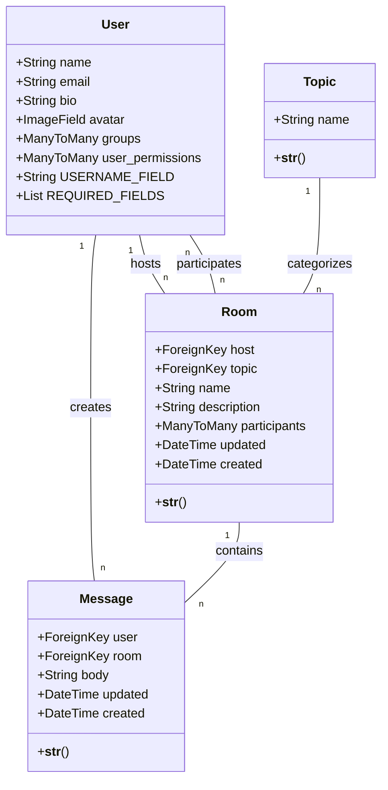
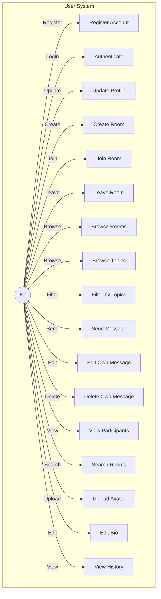
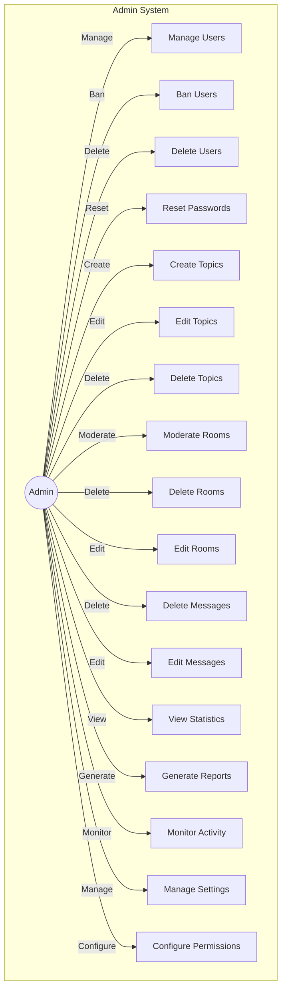
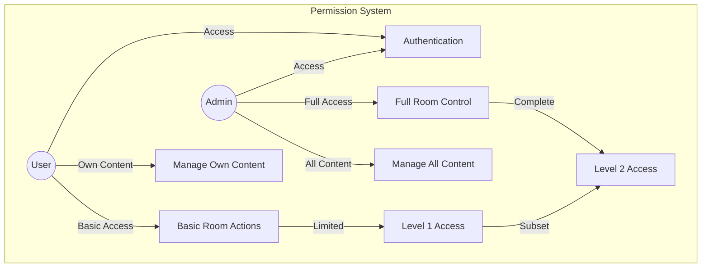

# System Diagrams

## Class Diagram

```mermaid
classDiagram
    class User {
        +String name
        +String email
        +String bio
        +ImageField avatar
        +ManyToMany groups
        +ManyToMany user_permissions
        +String USERNAME_FIELD
        +List REQUIRED_FIELDS
    }
    
    class Topic {
        +String name
        +__str__()
    }
    
    class Room {
        +ForeignKey host
        +ForeignKey topic
        +String name
        +String description
        +ManyToMany participants
        +DateTime updated
        +DateTime created
        +__str__()
    }
    
    class Message {
        +ForeignKey user
        +ForeignKey room
        +String body
        +DateTime updated
        +DateTime created
        +__str__()
    }
    
    User "1" -- "n" Room : hosts
    User "n" -- "n" Room : participates
    Topic "1" -- "n" Room : categorizes
    User "1" -- "n" Message : creates
    Room "1" -- "n" Message : contains
```
# System Use Case Diagrams

## User Use Case Diagram

```mermaid
graph TD
    subgraph User System
        U((User))
        
        %% Authentication
        U --> |Register| REG[Register Account]
        U --> |Login| AUTH[Authenticate]
        U --> |Update| PROF[Update Profile]
        
        %% Room Management
        U --> |Create| CR[Create Room]
        U --> |Join| JR[Join Room]
        U --> |Leave| LR[Leave Room]
        U --> |Browse| BR[Browse Rooms]
        
        %% Topic Interaction
        U --> |Browse| BT[Browse Topics]
        U --> |Filter| FT[Filter by Topics]
        
        %% Communication
        U --> |Send| SM[Send Message]
        U --> |Edit| EM[Edit Own Message]
        U --> |Delete| DM[Delete Own Message]
        
        %% Room Participation
        U --> |View| VP[View Participants]
        U --> |Search| SR[Search Rooms]
        
        %% Profile Features
        U --> |Upload| UA[Upload Avatar]
        U --> |Edit| EB[Edit Bio]
        U --> |View| VH[View History]
    end
```

## Admin Use Case Diagram

```mermaid
graph TD
    subgraph Admin System
        A((Admin))
        
        %% User Management
        A --> |Manage| MU[Manage Users]
        A --> |Ban| BU[Ban Users]
        A --> |Delete| DU[Delete Users]
        A --> |Reset| RP[Reset Passwords]
        
        %% Content Management
        A --> |Create| CT[Create Topics]
        A --> |Edit| ET[Edit Topics]
        A --> |Delete| DT[Delete Topics]
        
        %% Room Management
        A --> |Moderate| MR[Moderate Rooms]
        A --> |Delete| DR[Delete Rooms]
        A --> |Edit| ER[Edit Rooms]
        
        %% Message Management
        A --> |Delete| DM[Delete Messages]
        A --> |Edit| EM[Edit Messages]
        
        %% System Management
        A --> |View| VS[View Statistics]
        A --> |Generate| GR[Generate Reports]
        A --> |Monitor| MA[Monitor Activity]
        
        %% Configuration
        A --> |Manage| MS[Manage Settings]
        A --> |Configure| CP[Configure Permissions]
    end
```

## Combined System Permissions Diagram

```mermaid
graph TD
    subgraph Permission System
        U((User))
        A((Admin))
        
        %% Shared Permissions
        U --> |Access| AUTH[Authentication]
        A --> |Access| AUTH
        
        %% Room Access
        U --> |Basic Access| BA[Basic Room Actions]
        A --> |Full Access| FA[Full Room Control]
        
        %% Content Management
        U --> |Own Content| OC[Manage Own Content]
        A --> |All Content| AC[Manage All Content]
        
        %% System Access Levels
        BA --> |Limited| L1[Level 1 Access]
        FA --> |Complete| L2[Level 2 Access]
        
        %% Access Hierarchy
        L1 --> |Subset| L2
    end
```
